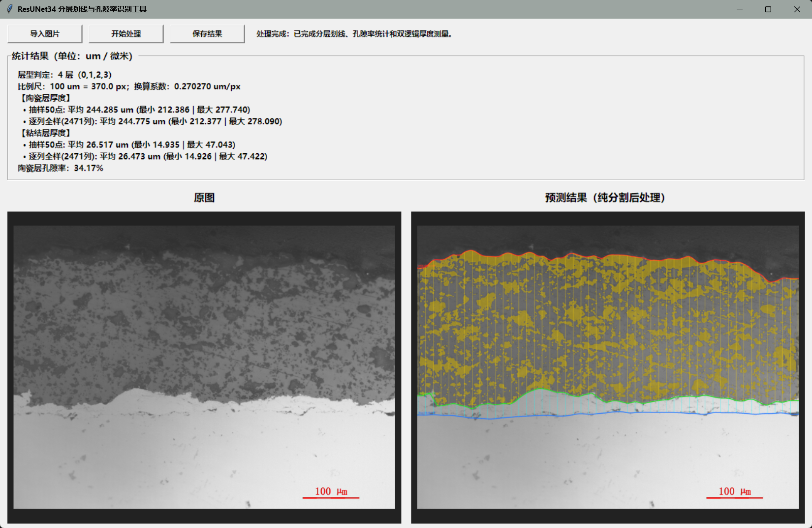
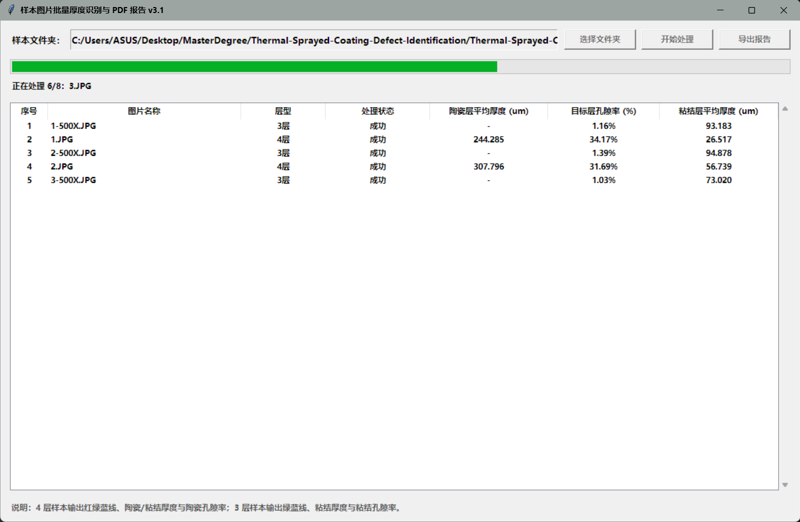

# Thermal-Sprayed-Coating-Defect-Identification-Repository
主要包括训练程序，边界提取脚本和批量提取脚本三个文件。批量提取脚本中涉及的OCR工具为Tesseract-OCR。我放置的位置在E:\Program Files\Tesseract-OCR
# 🔬 智能材料涂层分界检测与多维厚度/孔隙率分析系统


本系统是一个基于 **ResUNet34** 深度学习语义分割与 **计算机视觉后处理算法** 的材料金相/SEM图像分析工具。能够自动识别材料多层界面、动态提取连续分界线、精确识别图像右下角比例尺（OCR），并实现**双模式厚度测量**与目标层**孔隙率自动化分析**，最终一键导出多页 PDF 评估报告。

---

## 🌟 核心特性 (Key Features)

- 🧬 **高精度语义分割**：基于迁移学习的 ResUNet34 骨干网络，实现树脂/陶瓷/粘结/基体 4 层区域的精准分割。
- 📈 **自适应边界提取与光滑**：融合中值滤波与 Gaussian 一维平滑，基于像素连通性剔除噪声与比例尺伪影。
- 📏 **双轨制厚度测量算法**：
  - **全列全量逐像素测量**：捕捉微观局部最薄/最厚点及真实平均厚度。
  - **50点代表性抽样测量**：与 GUI / PDF 可视化标线一一对应，便于人工复核。
- 🔍 **智能化比例尺检测 & OCR**：自动定位右下角比例尺线段，结合 Tesseract OCR 多方案识别数值与换算系数（$\mu m/px$）。
- 🕳️ **孔隙率统计分析**：结合 Otsu 动态自适应阈值与形态学处理，自动提取目标涂层内的孔隙/缺陷占比。
- 📄 **批量处理与 PDF 报告生成**：支持单图可视化交互 GUI 与多图批量处理，自动导出带有防覆盖机制的多页 PDF 评估报告。

---

## 📸 运行效果 (Demo)

### 1. 单图交互分析界面 (`enhanced_boundary_detector.py`)


### 2. 批量处理与 PDF 导出 (`piliang_edit.py`)


---

## 🛠️ 安装与快速开始 (Getting Started)

### 1. 环境准备
推荐使用 Python 3.9+ 环境：
```bash
git clone https://github.com/你的用户名/Material-Layer-Segmentation.git
cd Material-Layer-Segmentation
pip install -r requirements.txt
```

2. 安装 OCR 依赖 (Tesseract-OCR)
系统需要 Tesseract OCR 支持以自动识别比例尺数字：

Windows: 下载并安装 Tesseract-OCR，并在 config.json 中配置安装路径（例如 E:/Program Files/Tesseract-OCR/tesseract.exe）。
Linux: sudo apt-get install tesseract-ocr
3. 模型权重下载
请将训练好的 best_unet_model_v3.pth 权重文件下载并放置于项目根目录或 models/ 目录下：

通过网盘分享的文件：best_unet_model_v3.pth
链接: https://pan.baidu.com/s/1UYqfJemuSsgk5VraM0InUQ?pwd=vs4q 提取码: vs4q

🚀 使用指南 (Usage)

单图分析与预测 GUI
python enhanced_boundary_detector.py
功能：支持导入单张图像、实时展示分割与划线结果、显示双逻辑测量数据。

批量处理与 PDF 报告生成 GUI
python piliang_edit.py
功能：选择文件夹对多张样本图像进行一键批量处理，并导出多页 PDF 分析报告。

⚙️ 配置文件说明 (config.json)
系统参数高度解耦，可在 config.json 中灵活配置：
{
  "paths": {
    "tesseract_cmd": "C:/Program Files/Tesseract-OCR/tesseract.exe",
    "model_path": "models/best_unet_model_v3.pth"
  },
  "settings": {
    "image_size": [768, 768],
    "num_classes": 4,
    "thickness_sample_count": 50,
    "scale_roi_left_ratio": 0.7,
    "scale_roi_top_ratio": 0.8
  }
}

📄 开源协议 (License)
本项目基于 MIT License 开源。

